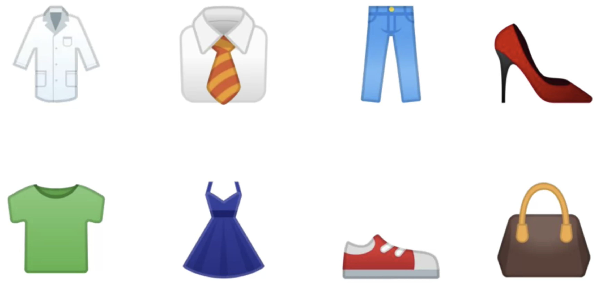
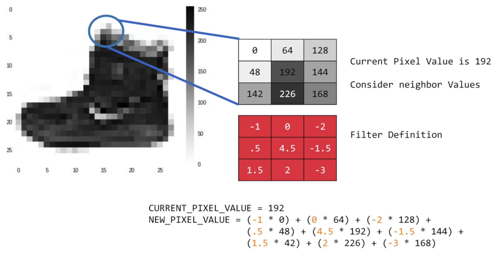

<div align="center">
  <h1>TensorFlow in Practice Specialization</h1>
</div>

<div align="center"> 
  
</div>

# Table of Content
- [Introduction to TensorFlow for Artificial Intelligence, Machine Learning, and Deep Learning](#Introduction-to-TensorFlow-for-Artificial-Intelligence,-Machine-Learning,-and-Deep-Learning)
  - [A new programming paradigm](#A-new-programming-paradigm)
    - [A primer in machine learning](#A-primer-in-machine-learning)
    - [The Hello World of neural networks](#The-Hello-World-of-neural-networks)
    - [From rules to data](#From-rules-to-data)
  - [Introduction to Computer Vision](#Introduction-to-Computer-Vision)
    - [An introduction to computer vision](#An-introduction-to-computer-vision)
    - [Writing code to load training data](#Writing-code-to-load-training-data)
    - [Coding a Computer Vision Neural Network](#Coding-a-Computer-Vision-Neural-Network)
    - [Using Callbacks to control training](#Using-Callbacks-to-control-training)
  - [Enhancing Vision with Convolutional Neural Networks](#Enhancing-Vision-with-Convolutional-Neural-Networks)
    - [What are convolutions and pooling?](#What-are-convolutions-and-pooling?)


# Introduction to TensorFlow for Artificial Intelligence, Machine Learning, and Deep Learning

## A new programming paradigm

### A primer in machine learning

In _traditional programming_ we establish the rules. In _machine learning_ is all about a computer learning the patterns that distinguish things.

<div align="center"> 
  
</div>

An example of this is made an "Hello World" of neural networks to see this. But first see this 2 vectors:

```
X = -1, 0, 1, 2, 3, 4
Y = -3, -1, 1, 3, 5, 7
```

With you mind you can figure out the solution for this.

```
y = 2x - 1
```

But in machine learning when try figure out this rule, the machine will use probabilities to solve this. So if we try to predict `x = 10`, with our function `y = 2x - 1` we get `y = 90`, but with machine learning we going to be close to `90`.

### The Hello World of neural networks

A neural network is basically a set of functions wich can learn patterns. The simpliest neural network is one that has only one neuron in it.

```py
# This line of code usings TensorFlow and the API Keras.
model = keras.Sequential([keras.layers.Dense(units=1, input_shape=[1])])
```

- **Dense:** define a layer.
- **units:** define the numbers of neurons in the layer.
- **input_shape:** is the shape of inputs for the layer.

For compile our neural network we use the compile method.

```py
model = keras.Sequential([keras.layers.Dense(units=1, input_shape=[1])])
model.compile(optimizer='sgd', loss='mean_squared_error')
```

- **compile:** is a method from keras objetct, to compile the Sequential layers.
- **optimizer:** make corrections in model.
- **loss:** measure the error.

Our model dosn't have an idea to how solve the problem, so it will be start with a guest, so we get an wrong answer, but with the **loss function** we can **measure that error**, and this **measure** will goint to the **optimizer** wich **figures out** the next guess.

The next step is represent the know data and train the model.

```py
model = keras.Sequential([keras.layers.Dense(units=1, input_shape=[1])])
model.compile(optimizer='sgd', loss='mean_squared_error')

# The know data.
xs = np.array([-1.0, 0.0, 1.0, 2.0, 3.0, 4.0], dtype=float)
ys = np.array([-3.0, -1.0, 1.0, 3.0, 5.0, 7.0], dtype=float)

# Training the model.
model.fit(xs, ys, epochs=500)
```

- **epochs:** determine how many times loop the training model with the process describe earlier.

### From rules to data

You saw that the traditional paradigm of expressing rules in a coding language may not always work to solve a problem. As such, scenarios such as Computer Vision are very difficult to solve with rules-based programming. Instead, if we feed a computer with enough data that we describe (or label) as what we want it to recognize, given that computers are really good at processing data and finding patterns that match, then we could potentially ‘train’ a system to solve a problem. We saw a super simple example of that -- fitting numbers to a line.

## Introduction to Computer Vision

### An introduction to computer vision

Computer vision is the field of having a computer understand and label what is present in an image. Consider this slide. When you look at it, you can interpret what a shirt is or what a shoe is, but how would you program for that? 

<div align="center"> 
  
</div>

So one way to solve that is to use lots of pictures of clothing and tell the computer what that's a picture of and then have the computer figure out the patterns that give you the difference between a shoe, and a shirt, and a handbag, and a coat.

### Writing code to load training data

In this lesson, you're going to use them to go a little deeper but the overall API should look familiar. The one big difference will be in the data. The last time you had your six pairs of numbers, so you could hard code it. This time you have to load 70,000 images off the disk, so there'll be a bit of code to handle that. Fortunately, it's still quite simple because Fashion-MNIST is available as a data set with an API call in TensorFlow. We simply declare an object of type MNIST loading it from the Keras database. On this object, if we call the load data method, it will return four lists to us.

```py
import tensorflow as tf
from tensorflow import keras

fashion_mnist = keras.datasets.fashion_mnist
(train_images, train_labels), (test_images, test_labels) = fashion_mnist.load_data()
```

### Coding a Computer Vision Neural Network

In our new **sequential** now we have three layers. The important things to look at are the **first** and the **last** layers.

```py
model = keras.Sequential([
    keras.layers.Flatten(input_shape=(28, 28)),
    keras.layers.Dense(128, activation=tf.nn.relu),
    keras.layers.Dense(10, activation=tf.nn.softmax)
])
```

The **last** layer has 10 neurons in it because we have 10 classes of clothing in the dataset, and they should always match.

The **first** layer is a flatten layer with the input shaping 28 by 28, and if you remember our images are 28 by 28 square and turns it into a simple linear array.

Beetween we have the **hidden** layer and here the interesting things happen. These are like variables in a function.

- **Sequential**: That defines a SEQUENCE of layers in the neural network

- **Flatten**: Remember earlier where our images were a square, when you printed them out? Flatten just takes that square and turns it into a 1 dimensional set.

- **Dense**: Adds a layer of neurons

- Each layer of neurons need an **activation function** to tell them what to do. There's lots of options, but just use these for now.

- **Relu** effectively means "If X>0 return X, else return 0" -- so what it does it it only passes values 0 or greater to the next layer in the network.

- **Softmax** takes a set of values, and effectively picks the biggest one, so, for example, if the output of the last layer looks like [0.1, 0.1, 0.05, 0.1, 9.5, 0.1, 0.05, 0.05, 0.05], it saves you from fishing through it looking for the biggest value, and turns it into [0,0,0,0,1,0,0,0,0] -- The goal is to save a lot of coding!

### Using Callbacks to control training

How can I stop training when I reach a point that I want to be at? What do I always have to hard code it to go for certain number of epochs? The good news is the training loop does support **callbacks**.

In every epoch, you can callback to a code function, having checked the metrics. If they're what you want to say, then you can cancel the training at that point.

```py
import tensorflow as tf
print(tf.__version__)

# Here we create our callback.
class myCallback(tf.keras.callbacks.Callback):
  def on_epoch_end(self, epoch, logs={}):
    if(logs.get('loss')<0.05): # When our loss function is lower than 5%.
      print("\nReached 95% accuracy so cancelling training!") # Print a message.
      self.model.stop_training = True # And stop training.

# And it need to be an instance.
callbacks = myCallback()

mnist = tf.keras.datasets.mnist

(training_images, training_labels), (test_images, test_labels) = mnist.load_data()

training_images=training_images/255.0
test_images=test_images/255.0

model = tf.keras.models.Sequential([tf.keras.layers.Flatten(),
                                    tf.keras.layers.Dense(1024, activation=tf.nn.relu),
                                    tf.keras.layers.Dense(10, activation=tf.nn.softmax)
])

model.compile(optimizer='adam', loss='sparse_categorical_crossentropy')

# We should pass our callbacks to the param callbacks in the fit function.
model.fit(training_images, training_labels, epochs=30, callbacks=[callbacks])
```

## Enhancing Vision with Convolutional Neural Networks

### What are convolutions and pooling?

If you've ever done any kind of image processing, it usually involves having a **filter** and passing that **filter** over the image in order to change the underlying image.

For every pixel, take its value, and take a look at the value of its neighbors. If our filter is three by three, then we can take a look at the immediate neighbor, so that you have a corresponding three by three grid. Then to get the new value for the pixel, we simply multiply each neighbor by the corresponding value in the filter. 

<div align="center"> 
  
</div>