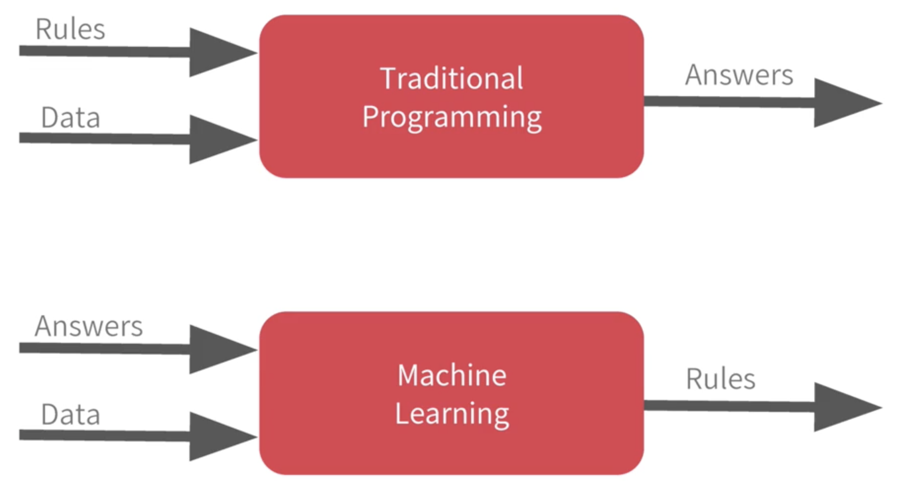

  <h1>TensorFlow in Practice Specialization</h1>

 
  

# Table of Content
- [Introduction to TensorFlow for Artificial Intelligence, Machine Learning, and Deep Learning](#Introduction-to-TensorFlow-for-Artificial-Intelligence,-Machine-Learning,-and-Deep-Learning)
    - [A new programming paradigm](#A-new-programming-paradigm)

# Introduction to TensorFlow for Artificial Intelligence, Machine Learning, and Deep Learning

## A new programming paradigm

In _traditional programming_ we establish the rules. In _machine learning_ is all about a computer learning the patterns that distinguish things.

 
  

